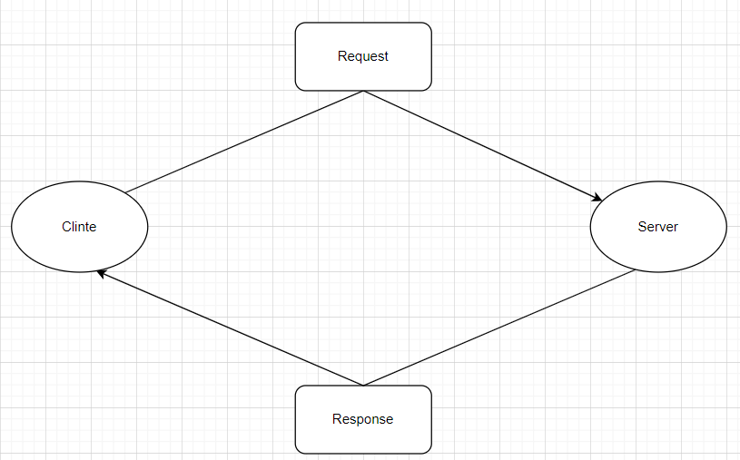

# Movies-Library

**Author Name**: Yaman Ayoun
## WRRC

## Getting Started

first you should `npm install express` on terminal for project ,then all packges is abear on your project.
## Project Features
you can see movie information and you can change to favorate page ,and if you use any `wrong url` the you take 404 error , when you type `/error` after url will abear error 500.